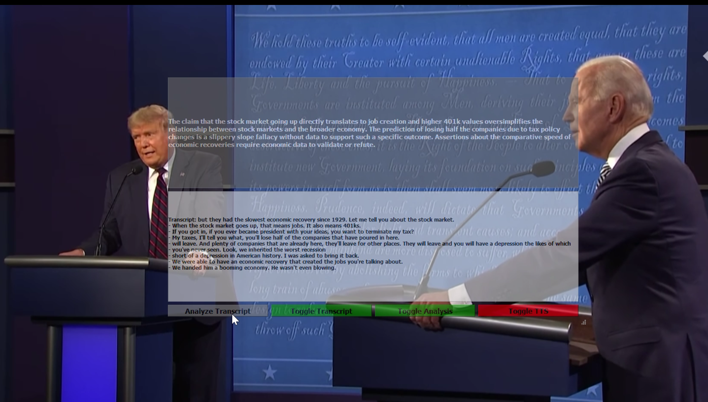

# Real-time Fallacy Detection

## Overview

This project aims to perform real-time fallacy detection during events like presidential debates. It uses the [Whisper](https://github.com/openai/whisper) for audio transcription.  For natural language understanding and fallacy classification you have the option to use the OpenAI ChatGPT API or a local LLM through the [text-generation-webui](https://github.com/oobabooga/text-generation-webui). I was able to run both whisper with the [Mistral-7B-OpenOrca-GPTQ](https://huggingface.co/TheBloke/Mistral-7B-OpenOrca-GPTQ) on a single RTX 3090.

[Watch Video](https://www.youtube.com/watch?v=PdhrTjia_pM)


## Features

- **Real-time Audio Transcription**: Uses OpenAI's Whisper ASR model for accurate real-time transcription.
- **Fallacy Detection**: Utilizes OpenAI's ChatGPT to classify and identify fallacies in real-time.
- **Overlay Display**: Provides a transparent overlay display to show both the transcription and fallacy detection results.
- **Text analysis**: using GPT-3/4 or local LLM
- **Save analyzed data**: SAVE to a JSON file for further analysis

## Dependencies

- PyQt5
- PyAudio
- OpenAI's Whisper ASR and ChatGPT API
- Have the text-generation-webui running with the API flag 
- (any other dependencies)

## Installation

1. Clone the repository:
    ```
    git clone https://github.com/your_username/real-time-fallacy-detection.git
    ```
2. Navigate to the project directory:
    ```
    cd real-time-fallacy-detection
    ```
3. Install the required packages:
    ```
    pip install -r requirements.txt
    ```
4. Installing VB-AUDIO, to forward audio ouput as an input device (*Optional, but I don't know how to redirect audio otherwise) 
    (VB-Audio)[https://vb-audio.com/Cable/]

## Usage

Run the main script to start the application:
```
python main.py [--use_gpt4 --use_gpt3]
```

**Note**: The application routes the audio to VB-AUDIO for processing and then redirects it back to the user for playback. 

## Arguments
--use_gpt(3/4): Use this flag to toggle between  ChatGPT with or without GPT4. Default is to use local LLM.

## Display
The application will display an overlay with two sections:

- **Top Box**: Displays the fallacy classification from ChatGPT.
- **Bottom Box**: Displays the real-time transcription from the Whisper API.

Press the `Esc` key to close the application.

## Configuration

You can configure the audio input and outsource in the `settings.ini`.
- **device_input_name = VB-Audio**  <- must have 
- **device_output_name = Headphones (2- Razer**

Rename the `api_key.txt.template` to `api_key.txt` and add your OpenAI API key to it.

## License

This project is licensed under the MIT License.
